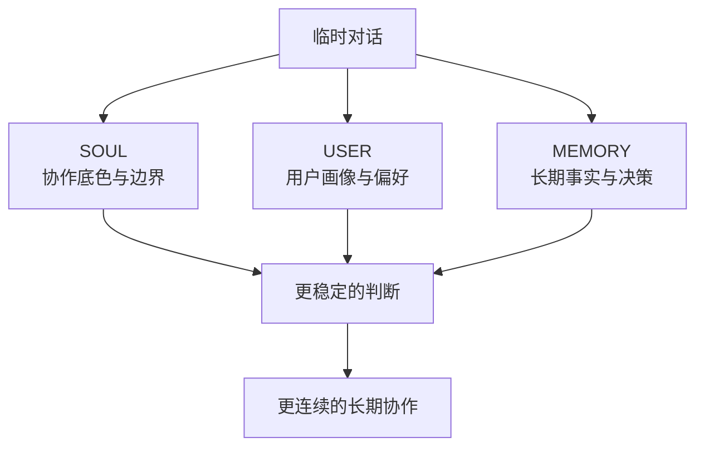
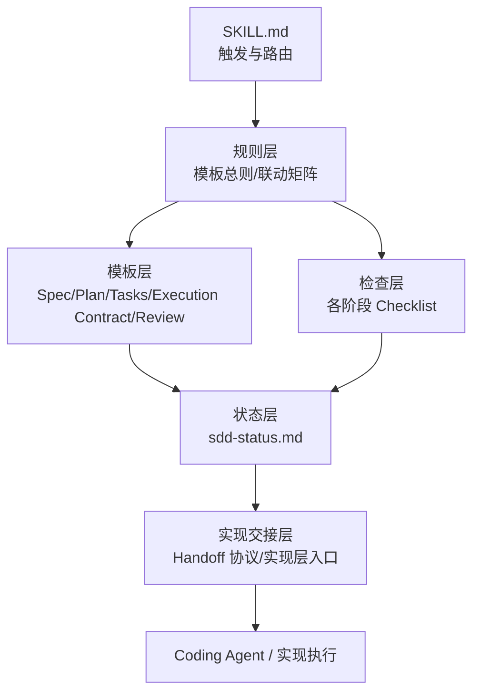
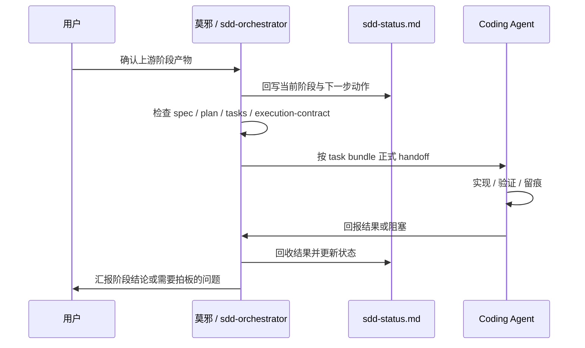

# 从没有章法到软件部门：`sdd-orchestrator` 的讨论、制定、实践与优化复盘

> 这不是一篇“我又做了一个 AI Skill”的展示文。  
> 这是一次长期人机协作方法，如何从混沌走向可复用系统的复盘。

最近这段时间，我和我的 AI 助手莫邪，一直在做一件很少被完整讲清楚的事：

**不是只让 AI 帮我写点东西，而是一起把“怎么协作、怎么推进、怎么留痕、怎么恢复、怎么交接”做成一套真正能跑起来的机制。**

这套机制最后收成了一个 OpenClaw Skill：`sdd-orchestrator`。

如果只看现在的仓库结构，你可能会觉得它无非是：

- 一个 `SKILL.md`
- 一组 `spec / plan / tasks / review` 模板
- 几个 checklist
- 几份 handoff 协议

但它真正的来路，其实是这样一条线：

**没有章法 → 补协作人格与记忆层 → 从 Scene/Mode 过渡到 SDD → 在真实项目里撞墙 → 把撞出来的经验固化成规则 → 把规则收成 skill → 再把 skill 作为未来“软件部门”协作底座。**

这篇文章，我想把这条线讲完整。

---

## 一、最开始的问题，不是“AI 不够聪明”，而是“协作没有章法”

很多人用 AI 卡住，不是因为模型不强，而是因为协作结构是散的。

最早我们遇到的问题非常典型：

1. **对话能聊很多，但很难形成稳定推进**
2. **一换会话，很多上下文就得重新补**
3. **说是推进了，但没有落盘痕迹，很难判断到底有没有真推进**
4. **阶段边界不清，容易今天聊 spec，明天顺手写 plan，后天又直接进实现**
5. **AI 很容易“看起来懂了”，但没有形成可恢复、可验证、可复用的协作链路**

所以我们很快意识到：

> 真正的问题不是“缺一个更强的 prompt”，而是缺一套长期协作的骨架。

---

## 二、第一步不是上 SDD，而是先把协作体养起来：`SOUL`、`USER`、`MEMORY`

很多人会把这一步误解成“给 AI 写人设”。

其实不是。

我们之所以给莫邪配置 `SOUL.md`、`USER.md`、`MEMORY.md`，核心不是为了拟人化，而是为了先解决三个工程问题：

- **判断一致性**：不同会话里，不要像换了一个助手
- **长期连续性**：重要决策不能只存在聊天记录里
- **协作边界**：什么该主动，什么该确认，什么不能越界

也就是说，这一层本质上是：

> **把“协作人格、长期记忆、用户偏好、行为边界”显式化。**

这一步做好之后，AI 才不再只是一次性工具，而开始变成一个可持续合作的“协作体”。

### 协作底座示意图



这一层的价值是：

- 让 AI 不再每轮都从零开始理解你
- 让“协作方式”本身成为可以迭代的对象
- 为后面的项目方法论沉淀，先铺好人格与记忆底座

---

## 三、第二步：我们不是直接发明 `sdd-orchestrator`，而是先完成了“从 Scene/Mode 到 SDD”的迁移

一开始，我们的协作里其实已经有了 Scene / Mode 这样的分层：

- 闲聊
- 发散
- 规划
- 推进
- 复盘
- 快速任务

这套东西对“对话姿态切换”是有价值的。

但一旦进入正式项目推进，它不够了。

因为项目推进真正需要的不是“我现在是什么模式”，而是：

- 当前属于哪个阶段
- 这个阶段的主文档是否成立
- 能不能进入下一个阶段
- 当前阶段的结果有没有真实痕迹
- 中断后如何恢复

于是我们在长期协作里做了一个关键迁移：

> **保留 Scene 作为对话层姿态，但把正式项目推进默认框架切换为 SDD。**

我们最终收口出的 SDD 主线非常清楚：

1. `Specify`
2. `Plan`
3. `Task`
4. `Implement`

分工也同步明确：

- 用户重点参与 `Specify / Plan / Task / 验收`
- AI 默认更多兜住 `Implement`

### 从“聊天推进”到“阶段推进”的变化


这一步非常重要。

因为从这里开始，我们不再把“推进”理解成聊天内容越来越多，而是理解成：

> **阶段文档、阶段门禁、阶段证据、阶段切换，是否形成闭环。**

---

## 四、为什么后来一定会长出 `sdd-orchestrator`

到这一步，很多人会觉得：

“那不就是有了 SDD 以后，写几份模板就行了吗？”

恰恰不是。

我们在真实讨论和实践里很快发现，模板只能解决“写什么”，但解决不了“怎么推进”。

最容易失控的地方恰恰是这些：

- 文档写了，但阶段没真的成立
- 草案和定稿混着用
- 口头上说进入下一阶段，项目里却没落文档
- `sdd-status.md` 和实际文档状态不一致
- `review.md` 这种固定入口文档，和 `spec-002 / plan-002` 这种轮次文档容易脱锚
- 实现交给 Coding Agent 后，协作边界开始漂移

也正是在这个阶段，我们才越来越明确：

> `sdd-orchestrator` 不能只是模板包，它必须是一个 **SDD 协作编排器**。

也就是：

- 它负责**阶段识别**
- 负责**阶段门禁**
- 负责**状态卡维护**
- 负责**文档联动检查**
- 负责**中断恢复**
- 负责**Implement 前 handoff**
- 负责**Review 收口**

一句话说：

> **它管的是推进秩序，而不只是文档格式。**

---

## 五、`sdd-orchestrator` 不是拍脑袋设计出来的，而是在 `local-kb-assistant` 实战里被“撞”出来的

真正让这套东西长成型的，不是空想，而是实战。

在 `local-kb-assistant` 这个项目里，我们真实经历了几轮 SDD 推进，也真实撞出了很多规则。

### 1. 撞出来的第一条硬规则：没有执行痕迹，不算已推进

这是非常关键的一条。

如果一个阶段“看起来聊完了”，但没有真实证据，比如：

- 文档改动
- 测试执行
- 结果落盘
- commit 记录
- 阶段产物摘要

那就不能宣称“已经推进了”。

这条规则后来变成了长期协作基线。

### 2. 撞出来的第二条硬规则：不许越阶段

我们后来把这条规则压得很实：

- 若用户说“按 SDD 从头来”，就必须按顺序推进
- 当前阶段没收口，不能提前进下个阶段
- 对话里的草稿不等于项目里的正式阶段主文档
- 当前阶段主文档没落盘，就不能口头宣布进入下游阶段

### 3. 撞出来的第三条硬规则：`sdd-status.md` 必须锚定真实项目状态

这条规则看起来像文档细节，实际上是“跨会话恢复”的核心。

只要状态卡和真实文档状态脱锚，后面就会出现两类假象：

- 以为已经进入下一阶段，其实没有
- 以为当前可恢复，结果恢复后发现路径是错的

所以后面我们把 `sdd-status.md` 提升成了：

- 当前阶段锚点
- 文档状态锚点
- 中断恢复入口
- 下一步唯一推荐动作入口

### 4. 撞出来的第四条硬规则：Review 收口不等于仓库已经稳定

这也是实战里特别容易忽略的一点。

就算 `review.md` 里已经形成“通过 / 有条件通过 / 阶段性通过”的语义，也还要继续检查：

- 当前工作区有没有相关未提交改动
- 文档头信息是否与当前轮次一致
- 固定入口文档和轮次文档映射是否清楚

也就是说：

> **语义收口，不自动等于快照收稳。**

---

## 六、它是怎么从“规则集合”长成“仓库结构”的

到后面，`sdd-orchestrator` 的目录结构逐渐稳定成现在这样：

```text
sdd-orchestrator/
├── README.md
├── SKILL.md
├── references/
│   ├── 索引与导航.md
│   ├── SDD 模板总则.md
│   ├── SDD 联动更新矩阵.md
│   ├── Coding Agent Handoff 协议.md
│   ├── 实现层入口与链路.md
│   ├── core-templates/
│   │   ├── spec.md
│   │   ├── plan.md
│   │   ├── tasks.md
│   │   ├── execution-contract.md
│   │   ├── sdd-status.md
│   │   └── review.md
│   └── checklists/
│       ├── specify-checklist.md
│       ├── plan-checklist.md
│       ├── tasks-checklist.md
│       ├── implement-handoff-checklist.md
│       ├── review-checklist.md
│       └── document-header-checklist.md
```

这里面有几个关键收敛动作：

### 1. `SKILL.md` 变瘦
它不再负责把所有解释都塞进去，而是变成：

- 触发入口
- 场景分流器
- 硬规则入口
- 最小读取导航

### 2. `references/` 变重
真正细的内容逐步下沉：

- 上位规则
- 联动矩阵
- 模板
- 检查单
- handoff 协议
- 实现层链路

### 3. “模板”和“编排”被清楚分开
这一步很重要。

因为很多人做方法论资产，最后都会掉进一个坑：

> 什么都写了，但没有入口结构。

现在这版 `sdd-orchestrator` 至少已经把：

- **入口层**
- **规则层**
- **模板层**
- **检查层**
- **实现交接层**

这五层分开了。

### 分层结构图



---

## 七、为什么后来一定会长出 `execution-contract`、handoff 协议和上下文隔离

如果只做 `spec / plan / tasks`，那么一到 Implement，链路就会重新变黑箱。

典型问题是：

- 交给 Coding Agent 后，它到底应该看哪些文档
- 它能不能顺手扩范围
- 它完成后要不要更新状态卡
- 它汇报到什么粒度才合适
- 出现歧义时，什么时候必须回主对话

所以后来我们明确补出了这一整段实现链路：

- `execution-contract.md`
- `implement-handoff-checklist.md`
- `Coding Agent Handoff 协议.md`
- `实现层入口与链路.md`

并且把角色边界说死：

- `sdd-orchestrator`：负责推进编排
- handoff 协议：负责交接规则
- Coding Agent：负责施工执行

### Implement 交接链路图



这一步的价值在于：

> 我们不再把 Implement 当成“AI 自己去干吧”，而是把它纳入了 SDD 编排闭环。

---

## 八、仓库版 skill 与运行时 skill 分离，是另一个很实战的认知升级

这个点特别像工程里常见的“源码”和“部署产物”的区别。

后来我们明确区分了两套载体：

### 仓库版
用于：

- 讨论
- 修改
- commit / push
- 对外沉淀

### runtime skill 版
用于：

- 真正被 OpenClaw 识别和加载
- 实际执行时读取
- 与仓库版同步，但不直接承担仓库维护职责

这是一个很容易被忽略、但非常关键的点：

> **仓库版已更新，不等于运行时已经生效。**

也正因为踩过这个坑，后面我们才把“双载体同步”纳入长期规则。

---

## 九、从提交历史看，它的演化不是“先想全再实现”，而是“实战—补规则—再实战”

`sdd-orchestrator` 仓库这几天的提交记录，其实很能说明问题。

| 日期 | Commit | 关键信息 |
|---|---|---|
| 2026-03-22 | `b141e8e` | 初始化 skill 包与试运行文档 |
| 2026-03-22 | `e2fef6a` | 补充阶段确认后主文档状态回写规则 |
| 2026-03-22 | `aa40630` | 补充状态回写与检查单约束 |
| 2026-03-23 | `749be9e` | 补充阶段主文档落盘门槛 |
| 2026-03-23 | `0105d40` | 补充阶段确认后的命名收口约束 |
| 2026-03-23 | `fd62afb` | 补充通用阶段切换动作清单 |
| 2026-03-23 | `217a643` | 补充阶段起步与状态卡锚定约束 |
| 2026-03-24 | `4d24fc1` | 强化场景动作协议与文档自检机制 |
| 2026-03-24 | `cca6021` | 补强 review 收口联动与检查逻辑 |
| 2026-03-24 | `e0b353a` | 收束模板总则与文档头自检入口 |
| 2026-03-24 | `7123419` | 清理 references 版本状态残留措辞 |

从这些 commit 你会发现一个明显特征：

它的演化重点，并不是“继续加模板”，而是：

- 补阶段门禁
- 补状态回写
- 补文档落盘约束
- 补命名收口
- 补动作协议
- 补文档头自检
- 补 review 收口逻辑

这其实已经很能说明问题了：

> 真正让一套协作系统变稳的，从来不是模板数量，而是“约束是否够实，恢复是否可靠，交接是否闭环”。

---

## 十、为什么说它最终会指向“OpenClaw-软件部门”

如果到这里为止，`sdd-orchestrator` 还只是一个“项目级 skill”，那它的价值其实只完成了一半。

因为它真正更大的意义，在于它已经开始具备**组织协作底座**的雏形。

我们现在正在推进 `OpenClaw-软件部门`，这件事本质上不是“多建几个 agent”这么简单。

真正的问题是：

- 不同席位怎么分工
- 谁负责规划，谁负责实现，谁负责验收与文档
- 多 agent 协作时，如何避免上下文污染
- 阶段推进、状态回写、Review 收口，靠什么统一约束

而这时，`sdd-orchestrator` 的意义就变了。

它不再只是“一个项目的 SDD 工具”，而更像是：

> **软件部门内部的协作操作系统雏形。**

也就是说，从现在开始，`sdd-orchestrator` 的下一阶段价值不只是帮助一个项目推进，而是帮助一组角色、一套流程、一类组织协作，形成统一秩序。

### 从个人协作到软件部门的演化图


这个演化关系，才是我现在看这套东西时最兴奋的地方。

因为它说明我们做的不是一个局部技巧，而是在把：

- 长期协作
- 项目推进
- 多 agent 交接
- 组织化工作流

逐步收成一个统一体系。

---

## 十一、这一路走来，我觉得最值得总结的 6 条经验

### 1. 先把协作骨架立起来，再谈 prompt 技巧
没有人格边界、记忆层、规则层，再强的 prompt 也只能解决局部问题。

### 2. 模板不是方法，编排才是方法
模板解决“写什么”，编排解决“怎么推进、怎么恢复、怎么收口”。

### 3. 真正稳定的 SDD，一定要有状态卡
没有 `sdd-status.md` 这样的恢复锚点，多轮推进必然会越来越乱。

### 4. Implement 不能是黑箱
一旦交给 Coding Agent，就必须补交接协议、上下文边界和回收规则。

### 5. 规则不要靠想象补，要靠实战撞出来
这次很多最关键的规则，都不是预先设计出来的，而是在 `local-kb-assistant` 实战里被真实问题逼出来的。

### 6. 组织化协作，必须先有项目级秩序
如果连单项目的阶段推进、状态回写、交接闭环都没做好，就谈不上多 agent 的“软件部门”。

---

## 十二、结语：`sdd-orchestrator` 的价值，不是“文档更漂亮”，而是“协作终于长出了秩序”

回头看这一路，我越来越确定一件事：

我们真正做成的，不是一组 Markdown 模板，也不只是一个 OpenClaw Skill。

我们做成的，是一套从长期协作底座出发，能落到真实项目推进、还能继续长到组织级协作的秩序系统。

从没有章法，到给 AI 配 `SOUL` 和 `MEMORY`；
再到把 Scene/Mode 收敛进 SDD；
再到在真实项目里长出 `sdd-status`、`execution-contract`、handoff 协议、文档联动矩阵；
再到今天开始往 `OpenClaw-软件部门` 推进。

这条线对我最大的意义是：

> **AI 协作真正成熟，不是因为它更像人，而是因为它终于能在一个明确秩序里，持续、可靠、可恢复地一起做事。**

而 `sdd-orchestrator`，就是这套秩序目前最清晰的一次落盘。

---

## 附：如果你也想做类似的协作系统，可以先从这 4 件事开始

1. 先把长期协作里的“人格边界、用户偏好、长期记忆”显式化
2. 再把项目推进从“聊天式推进”切到“阶段式推进”
3. 给每个阶段补主文档、门禁和状态锚点
4. 在真实项目里跑一轮，再根据摩擦点反向补规则

不要一开始就试图设计一套完美系统。

更可行的路径是：

> **先跑起来，再把真实撞出来的问题，收成下一版规则。**

这也是 `sdd-orchestrator` 真正长出来的方式。