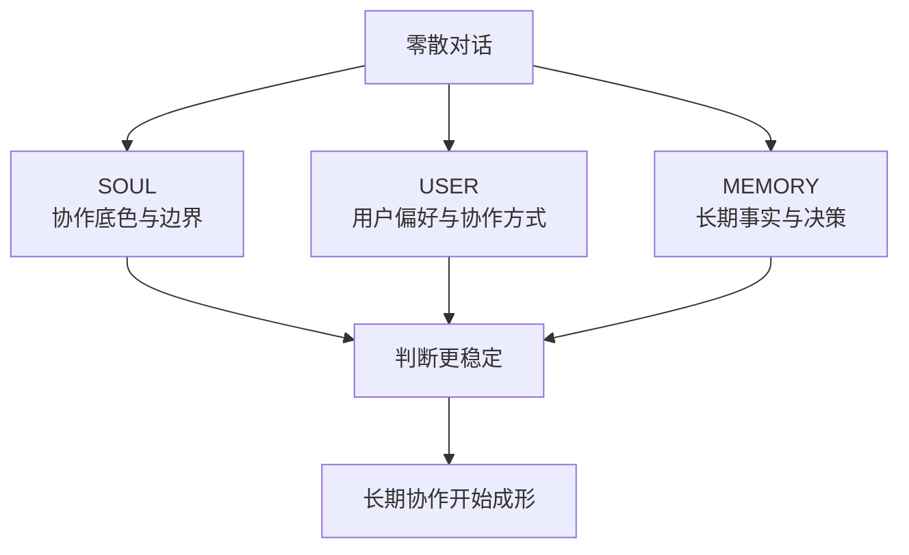
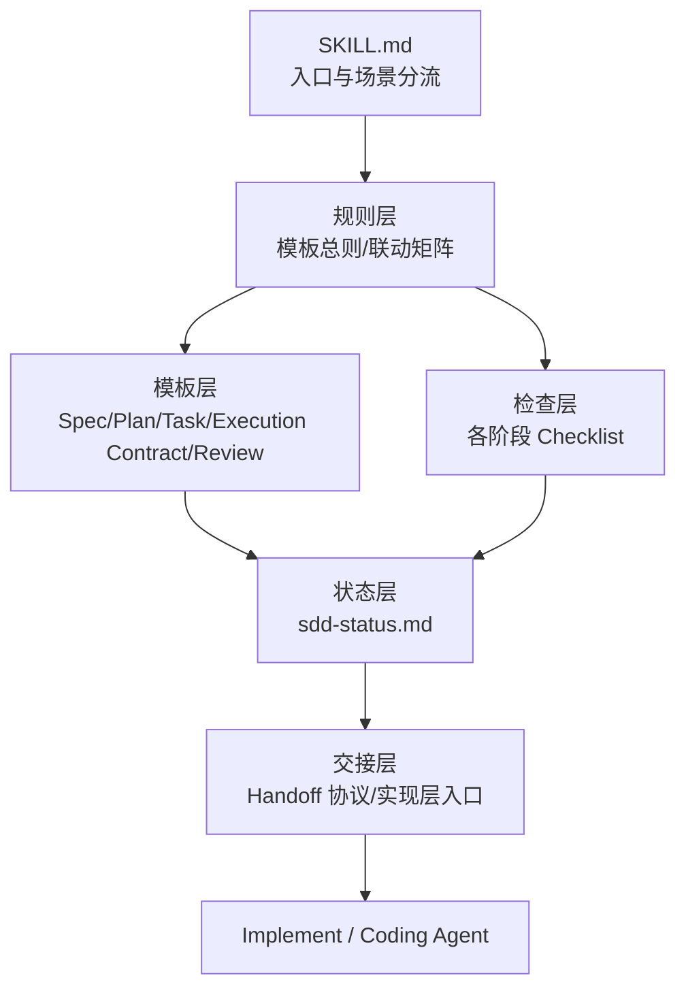
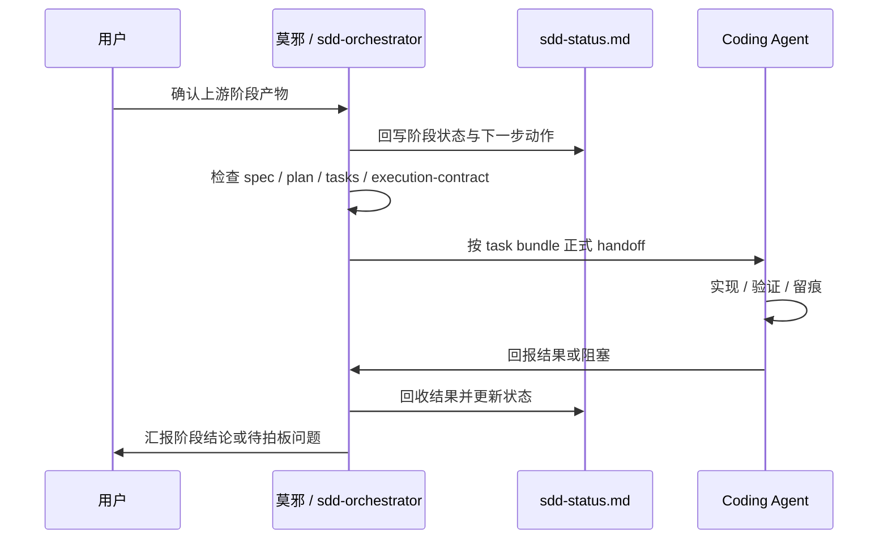

# 我把 AI 协作从混乱带到可落地：`sdd-orchestrator` 从 0 到 1 复盘

如果你也在用 AI 做项目，大概率遇到过这种情况：

- 聊的时候感觉很顺
- 一换会话就断片
- 说是“推进了”，其实没留下什么痕迹
- spec、plan、tasks 聊着聊着就串了
- 一到实现阶段，AI 很容易顺手扩范围，最后谁也说不清现在到底做到哪了

我这段时间一直在和自己的 AI 助手莫邪解决的，恰好就是这个问题。

最后，我们没有停在“写一套提示词”或者“整理几份模板”上，而是把整套协作方法收成了一个 OpenClaw Skill：`sdd-orchestrator`。

它现在看起来像一个 skill 仓库，但它真正解决的，其实是一个更底层的问题：

> **怎么把 AI 协作从“能聊”推进到“能稳定做事”。**

这篇文章，我不讲空的概念，直接复盘这条线是怎么长出来的：

**从最开始没有章法，到补 `SOUL` 和 `MEMORY`，再到把 Scene/Mode 迁到 SDD，在真实项目里撞出规则，最后开始往 `OpenClaw-软件部门` 演化。**

---

## 一、最开始的问题，不是模型不够强，而是协作太散

很多人会以为，AI 协作不稳定，是因为模型还不够聪明。

我后来越来越确定，不是。

更常见的真实问题是：**协作结构本身就是散的。**

一开始我们遇到的坑非常典型：

1. 对话很多，但没有稳定推进链路  
2. 换个会话，前面的判断和约定就得重新补  
3. 说“已经推进”，但没有文件、没有测试、没有结果落盘  
4. 当前到底在做需求、做计划，还是已经进实现了，边界很糊  
5. AI 很容易表现得“懂了”，但项目其实没有形成可恢复、可验证的状态

这时候我才意识到：

> 缺的不是一个更华丽的 prompt，而是一套长期协作的骨架。

---

## 二、第一步不是上 SDD，而是先把“协作体”养出来

很多人看到 `SOUL.md`、`USER.md`、`MEMORY.md` 这类文件，会觉得这只是“给 AI 配个人设”。

真做起来你会发现，它们根本不是装饰层，而是工程设施。

它们分别在解决三个很现实的问题：

- `SOUL.md`：让助手在不同会话里保持稳定判断，不像每次都换了一个人
- `USER.md`：把用户偏好、协作方式、关注点固定下来
- `MEMORY.md`：把长期有效的决策和共识，从聊天记录里拎出来，变成可复用的依据

也就是说，这一步做的其实是：

> **把“协作人格、用户偏好、长期记忆、行为边界”显式化。**

没有这一层，后面的项目方法论很容易空转。

### 协作底座是怎么长出来的



这一步做完之后，莫邪才不再只是“这轮会说话的工具”，而开始具备持续协作的底子。

---

## 三、我们不是直接发明 `sdd-orchestrator`，而是先完成了从 Scene/Mode 到 SDD 的迁移

一开始，我们已经有一套 Scene / Mode 机制，比如：

- 闲聊
- 发散
- 规划
- 推进
- 复盘
- 快速任务

这套东西对于切换“对话姿态”是有用的。

但它有一个明显短板：

**它适合对话管理，不够适合项目推进。**

因为正式做项目时，真正关键的不是“现在是哪个模式”，而是：

- 当前属于哪个阶段
- 这个阶段的主文档是否已经成立
- 能不能进入下一阶段
- 当前结论有没有真实痕迹
- 中断后下一次该从哪里恢复

所以后来我们做了一个很关键的迁移：

> **保留 Scene 作为对话层姿态，但把正式项目推进默认框架切到 SDD。**

最终收口下来的主线很清楚：

1. `Specify`
2. `Plan`
3. `Task`
4. `Implement`

分工也同步收实：

- 用户主要参与 `Specify / Plan / Task / 验收`
- AI 默认更多兜住 `Implement`

### 从“聊天推进”到“阶段推进”的变化


从这一步开始，我们不再把“聊了很多”误判成“推进了很多”，而是开始看：

> **阶段文档、阶段门禁、阶段证据、阶段切换，是否真的形成闭环。**

---

## 四、为什么后来一定会长出 `sdd-orchestrator`

很多人做 SDD，做到这里会停下来：

- 写 spec
- 写 plan
- 写 tasks
- 然后开始实现

但真进项目以后，很快就会发现一个问题：

**模板只解决了“写什么”，没有解决“怎么推进”。**

真实项目里最容易出问题的，恰恰是这些地方：

- 文档写了，但阶段没成立
- 草案和定稿混着用
- 口头说进入下一阶段，但项目里根本没落文档
- `sdd-status.md` 和真实文档状态脱锚
- `review.md` 这种固定入口，和 `spec-002 / plan-002` 这种轮次文档对不上
- 实现交给 Coding Agent 后，边界开始漂

也正是因为这些问题，我们后来越来越明确：

> `sdd-orchestrator` 不能只是模板包，它必须是一个 **SDD 协作编排器**。

它要管的不是“文档长什么样”，而是：

- 当前阶段怎么识别
- 阶段门禁怎么判断
- 状态卡怎么维护
- 文档变化后哪些地方要联动检查
- 中断后从哪里恢复
- Implement 前怎么 handoff
- Review 怎么收口

一句话概括：

> **它管的是推进秩序，不只是文档格式。**

---

## 五、真正把这套东西撞成型的，不是空想，而是 `local-kb-assistant` 实战

`sdd-orchestrator` 最重要的那些规则，基本都不是坐在椅子上拍脑袋想出来的。

它们是被 `local-kb-assistant` 这个真实项目一点点逼出来的。

### 1. 第一条硬规则：没有执行痕迹，就不算已推进

这是后来被我们压得最实的一条规则。

如果一个阶段“聊完了”，但没有真实证据，比如：

- 文档改动
- 测试执行
- 结果文件落盘
- commit 记录
- 阶段产物摘要

那就不能说“已经推进了”。

这条规则一出来，很多“看起来在推进”的假动作就被清掉了。

### 2. 第二条硬规则：不许越阶段

后来我们把这条规则明确成了长期基线：

- 用户说“按 SDD 从头来”，就必须按阶段顺序推进
- 当前阶段没结束，不能提前进下一阶段
- 对话里的草稿不等于项目里的正式阶段主文档
- 当前阶段主文档没落盘，不能口头宣布进入下游阶段

这一条看起来严格，但它极大减少了后面返工。

### 3. 第三条硬规则：`sdd-status.md` 必须锚定真实项目状态

这条规则看起来像文档细节，实际是恢复能力的核心。

只要状态卡和真实文档状态脱锚，后面就会立刻出问题：

- 以为自己已经进入下一阶段，其实没有
- 以为下次能从这个点恢复，结果恢复路径根本是错的

所以后面我们把 `sdd-status.md` 提升成了：

- 当前阶段锚点
- 文档状态锚点
- 中断恢复入口
- 下一步唯一推荐动作入口

### 4. 第四条硬规则：Review 收口，不等于仓库已经稳定

这也是实战里特别容易忽视的一点。

哪怕 `review.md` 里已经写出“通过 / 有条件通过 / 阶段性通过”，也还要继续检查：

- 工作区是否还有和本轮收口直接相关的未提交改动
- 文档头是不是已经切换到当前轮次
- 固定入口文档和轮次文档的映射有没有写清楚

也就是说：

> **语义收口，不自动等于快照收稳。**

---

## 六、到后面，`sdd-orchestrator` 才逐渐长成了现在这套结构

当规则越来越多时，如果没有结构，整套东西会再次变乱。

所以后面我们把仓库逐渐收成了现在这套层次：

```text
sdd-orchestrator/
├── README.md
├── SKILL.md
├── references/
│   ├── 索引与导航.md
│   ├── SDD 模板总则.md
│   ├── SDD 联动更新矩阵.md
│   ├── Coding Agent Handoff 协议.md
│   ├── 实现层入口与链路.md
│   ├── core-templates/
│   │   ├── spec.md
│   │   ├── plan.md
│   │   ├── tasks.md
│   │   ├── execution-contract.md
│   │   ├── sdd-status.md
│   │   └── review.md
│   └── checklists/
│       ├── specify-checklist.md
│       ├── plan-checklist.md
│       ├── tasks-checklist.md
│       ├── implement-handoff-checklist.md
│       ├── review-checklist.md
│       └── document-header-checklist.md
```

这里面最关键的，不是文件多了，而是**分层终于清楚了**：

- `SKILL.md`：入口和路由
- `references/`：上位规则和说明
- `core-templates/`：阶段模板
- `checklists/`：门禁和自检
- handoff 相关文档：连接 Implement

### 这套结构的分层关系



这时候，`sdd-orchestrator` 才真正开始像一个可复用 skill，而不是一堆资料文件。

---

## 七、为什么后来一定会长出 `execution-contract` 和 handoff 协议

如果你只做 `spec / plan / tasks`，一到 Implement，链路还是会重新变成黑箱。

典型问题非常现实：

- 交给 Coding Agent 后，它到底要看哪些文档
- 它能不能顺手扩范围
- 它做完以后要不要更新状态卡
- 它应该汇报到什么粒度
- 出现歧义时，什么时候必须回主对话

所以后来我们把 Implement 前后的链路也补全了：

- `execution-contract.md`
- `implement-handoff-checklist.md`
- `Coding Agent Handoff 协议.md`
- `实现层入口与链路.md`

并且把分工明确写死：

- `sdd-orchestrator`：负责推进编排
- handoff 协议：负责交接规则
- Coding Agent：负责施工执行

### Implement 交接链路



做到这里，Implement 才真正被拉回到 SDD 闭环里，而不是“丢给 AI 自己干吧”。

---

## 八、一个特别实战、但很容易被忽略的认知：仓库版 skill ≠ 运行时 skill

这个坑我们也是踩过才记住的。

后来我们明确区分了两套载体：

### 仓库版
负责：

- 讨论
- 修改
- commit / push
- 对外沉淀

### runtime skill 版
负责：

- 真正被 OpenClaw 识别和加载
- 实际执行时使用
- 与仓库版同步，但不直接承担仓库维护职责

这个认知看起来很工程化，但它特别重要。

因为：

> **仓库版已更新，不等于运行时已经生效。**

也正因为踩过这个坑，后面我们才把“双载体同步”纳入长期规则。

---

## 九、看提交历史就知道：它不是“想完整了再做”，而是“实战—补规则—再实战”

`sdd-orchestrator` 这几天的提交记录，其实很能说明它的成长方式。

| 日期 | Commit | 关键信息 |
|---|---|---|
| 2026-03-22 | `b141e8e` | 初始化 skill 包与试运行文档 |
| 2026-03-22 | `e2fef6a` | 补充阶段确认后主文档状态回写规则 |
| 2026-03-22 | `aa40630` | 补充状态回写与检查单约束 |
| 2026-03-23 | `749be9e` | 补充阶段主文档落盘门槛 |
| 2026-03-23 | `0105d40` | 补充阶段确认后的命名收口约束 |
| 2026-03-23 | `fd62afb` | 补充通用阶段切换动作清单 |
| 2026-03-23 | `217a643` | 补充阶段起步与状态卡锚定约束 |
| 2026-03-24 | `4d24fc1` | 强化场景动作协议与文档自检机制 |
| 2026-03-24 | `cca6021` | 补强 review 收口联动与检查逻辑 |
| 2026-03-24 | `e0b353a` | 收束模板总则与文档头自检入口 |
| 2026-03-24 | `7123419` | 清理 references 版本状态残留措辞 |

从这些 commit 你会发现一个很明显的特点：

它演化的重点，并不是继续加模板，而是不断补：

- 阶段门禁
- 状态回写
- 文档落盘约束
- 命名收口
- 动作协议
- 文档头自检
- review 收口逻辑

这其实就是一套协作系统真正成熟时该长的地方。

---

## 十、为什么我现在越来越觉得，它最终会指向 `OpenClaw-软件部门`

如果到这里为止，`sdd-orchestrator` 还只是一个“项目级 skill”，那它的价值只完成了一半。

因为它真正更大的意义，是已经开始具备**组织协作底座**的雏形。

我们现在正在推进 `OpenClaw-软件部门`。这件事本质上不是“多建几个 agent”这么简单。

真正的问题是：

- 不同席位怎么分工
- 谁负责规划，谁负责实现，谁负责验收和文档
- 多 agent 协作时，怎么避免上下文污染
- 阶段推进、状态回写、Review 收口，靠什么统一约束

走到这里你会发现，`sdd-orchestrator` 的定位已经在变了。

它不再只是“一个项目的 SDD 工具”，而更像是：

> **软件部门内部协作操作系统的雏形。**

### 从个人协作到软件部门的演化线


这一点其实是我现在最兴奋的地方。

因为这说明我们做的不是一个局部小技巧，而是在把：

- 长期协作
- 项目推进
- 多 agent 交接
- 组织化工作流

一点点收进同一套秩序里。

---

## 十一、这一路走下来，我觉得最值得带走的 6 条经验

### 1. 先把协作骨架立起来，再谈 prompt 技巧
没有人格边界、记忆层、规则层，再强的 prompt 也只能解决局部问题。

### 2. 模板不是方法，编排才是方法
模板解决“写什么”，编排解决“怎么推进、怎么恢复、怎么收口”。

### 3. 真正稳定的 SDD，一定要有状态卡
没有 `sdd-status.md`，多轮推进后大概率会越来越乱。

### 4. Implement 不能是黑箱
一旦交给 Coding Agent，就必须补交接协议、上下文边界和回收规则。

### 5. 规则不要靠想象补，要靠实战撞出来
这次很多最关键的规则，都是在 `local-kb-assistant` 实战里被问题逼出来的。

### 6. 组织化协作，必须先有项目级秩序
单项目都还没跑顺，就谈不上多 agent 的“软件部门”。

---

## 十二、最后一句：`sdd-orchestrator` 的价值，不是文档更漂亮，而是协作终于长出了秩序

回头看这一路，我现在最强烈的感受反而很简单：

我们真正做成的，不是一组 Markdown 模板，也不只是一个 OpenClaw Skill。

我们做成的，是一套能把长期协作、项目推进、实现交接和组织化工作流串起来的秩序系统。

从最开始没有章法；
到给 AI 配 `SOUL` 和 `MEMORY`；
再到把 Scene/Mode 收进 SDD；
再到在真实项目里长出 `sdd-status`、`execution-contract`、handoff 协议和联动矩阵；
再到今天开始往 `OpenClaw-软件部门` 推进。

这条线对我最大的价值是：

> **AI 协作真正成熟，不是因为它更像人，而是因为它终于能在一个明确秩序里，持续、可靠、可恢复地一起做事。**

而 `sdd-orchestrator`，就是这套秩序目前最完整的一次落盘。

---

## 附：如果你也想做类似系统，可以先从这 4 步开始

1. 先把长期协作里的“人格边界、用户偏好、长期记忆”显式化
2. 再把项目推进从“聊天式推进”切到“阶段式推进”
3. 给每个阶段补主文档、门禁和状态锚点
4. 在真实项目里跑一轮，再根据摩擦点反向补规则

不要一开始就追求完美系统。

更可行的路径其实是：

> **先跑起来，再把真实撞出来的问题，收成下一版规则。**