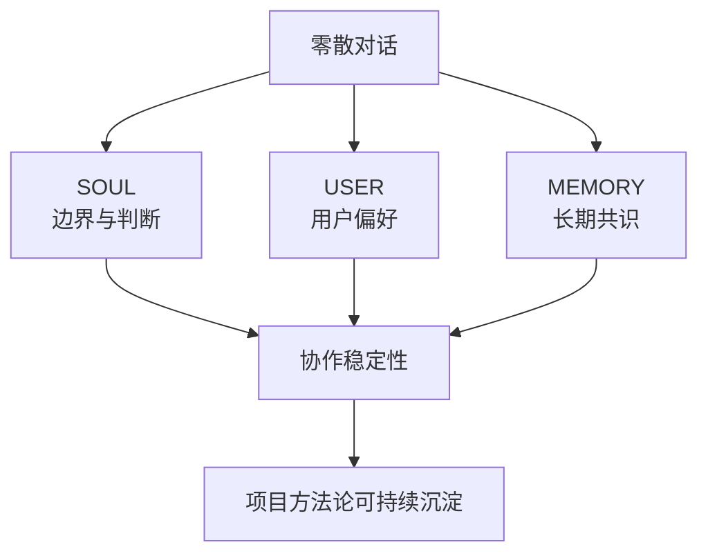
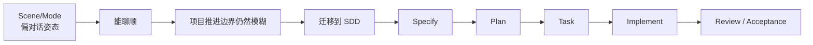
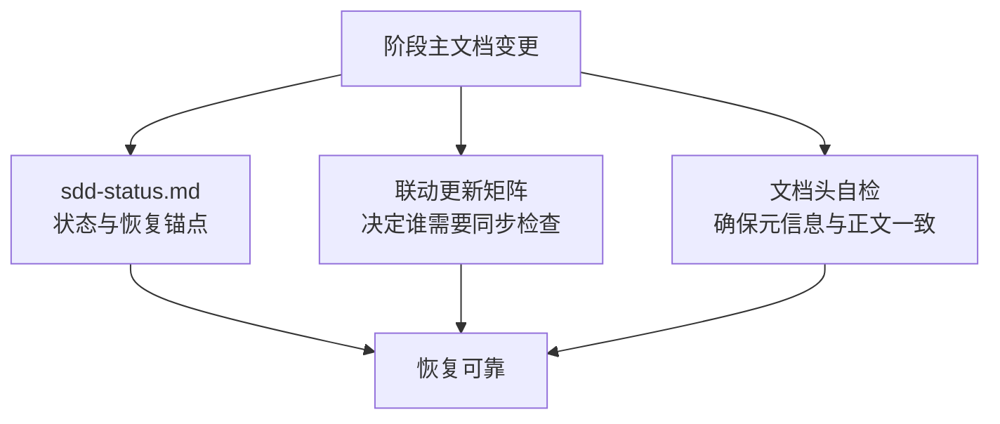
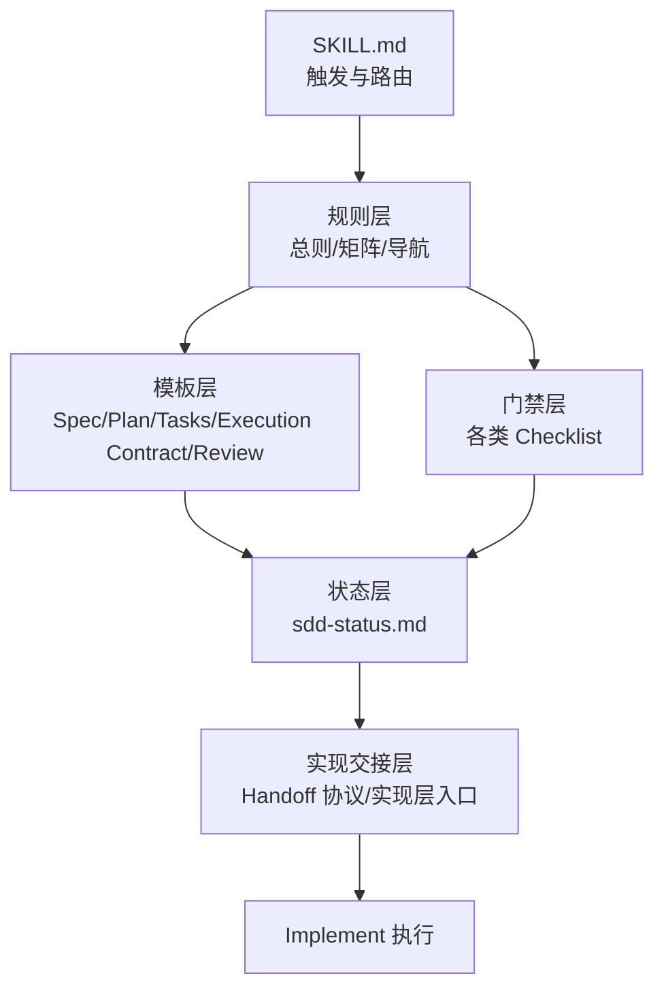
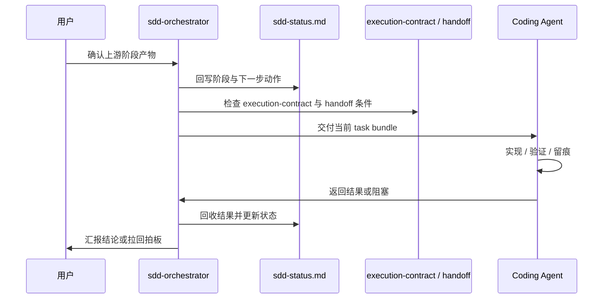

# 我把 AI 协作做成了一个可落地的 SDD 编排器：`sdd-orchestrator` 技术复盘

很多人做 AI 项目，真正卡住的地方，不是模型能力，而是协作失控。

表面上看，大家缺的是：

- 一个更强的 prompt
- 一套更完整的模板
- 一个更聪明的 coding agent

但只要项目真的开始推进，很快就会暴露出另一层问题：

- 需求、方案、任务、实现混在一起
- 一换会话，上下文就散
- 说“已经推进”，但没有实际证据
- 草稿和定稿混用，阶段边界越来越糊
- 实现一旦交给 agent，范围就容易漂
- review 结束了，但仓库状态和文档状态并没有真正收口

我这段时间和 AI 助手莫邪做的事情，核心就是解决这个问题。

最终，我们没有停在“补几份 spec / plan / task 模板”，而是把整套协作方法收成了一个 OpenClaw Skill：`sdd-orchestrator`。

它的定位不是文档模板包，而是一个 **Spec-Driven Development（SDD）编排器**：

- 管阶段识别
- 管阶段门禁
- 管文档联动
- 管状态卡维护
- 管中断恢复
- 管 Implement 前 handoff
- 管 Review 收口

这篇文章不讲空话，我直接把它是怎么从 0 长出来的、踩过哪些坑、最后为什么会变成现在这套结构，完整复盘一遍。

---

## 一、问题不是“AI 不够聪明”，而是“协作没有操作系统”

早期用 AI 做项目时，最常见的一种错觉是：

> 只要这轮对话聊顺了，项目就算在推进。

但真实情况往往不是这样。

因为“聊顺”和“推进”之间，差了至少四层东西：

1. **阶段边界**：当前到底在需求、方案、任务，还是已经进入实现？
2. **状态锚点**：下一次恢复时，应该从哪里接上？
3. **执行证据**：有没有真实文件改动、测试结果、提交记录？
4. **交接纪律**：实现交给子 agent 之后，谁保证边界不漂？

如果这四层没有，AI 协作再流畅，本质上也只是“高质量聊天”。

所以后来我们越来越明确：

> 真正缺的不是更会说的助手，而是一套协作操作系统。

而 `sdd-orchestrator`，就是这套操作系统在项目推进层的第一版落地。

---

## 二、为什么一开始不能直接做 SDD，而要先补 `SOUL / USER / MEMORY`

如果只从仓库角度看，`sdd-orchestrator` 好像是突然出现的。

但实际上，它前面有一层更基础的铺垫：

- `SOUL.md`
- `USER.md`
- `MEMORY.md`

很多人看到这三个文件，会把它们当“人设配置”。

我现在的理解是，它们更像协作基础设施。

### 1. `SOUL.md` 解决的是判断一致性
不同会话里，助手不应该像换了一个人。

它需要稳定地知道：

- 什么情况下该主动收口
- 什么情况下该先理解再行动
- 什么情况下不能越界替用户拍板
- 什么时候优先给结构，什么时候优先给下一步

### 2. `USER.md` 解决的是协作偏好稳定化
长期合作里，用户不是每一轮都应该重新解释自己。

例如：

- 更偏好高层协作而不是低层碎汇报
- 更在意阶段推进，而不是表面热闹
- 不接受“看起来推进了、实际上没有痕迹”的假推进

这些东西如果不显式写出来，后面的方法论很容易漂。

### 3. `MEMORY.md` 解决的是长期决策留存
很多关键判断，不应该只埋在聊天记录里。

比如：

- 默认项目推进框架已经迁移为 SDD
- 轻场景少打断，重场景前确认
- 没有清晰且确认的 Spec，不默认进入 Implement
- 阶段切换必须有实际执行证据支撑

这些一旦不沉淀，下一轮协作就很容易又回到老路上。

### 底层关系图



也就是说，`sdd-orchestrator` 不是凭空发明出来的。

它是建立在一层已经被稳定下来的长期协作底座之上的。

---

## 三、从 Scene/Mode 到 SDD：我们做的不是“替换对话模式”，而是“替换项目推进模型”

一开始，我们其实已经有一套 Scene / Mode 机制。

它适合做什么？

- 闲聊时，不要突然上结构
- 发散时，不要过早收敛
- 规划时，应该更强调边界、优先级和取舍
- 推进时，应该更强调下一步和落地动作
- 复盘时，应该看问题而不是情绪化归因

这套机制对**对话姿态管理**非常有用。

但问题是，它不够适合**正式项目推进**。

因为项目推进需要回答的，不只是“当前什么姿态合适”，而是：

- 当前属于哪一个正式阶段
- 进入下一个阶段的门槛是什么
- 当前阶段的主文档是什么
- 当前阶段是否已经形成有效产物
- 当前中断点和下一步动作能否可靠恢复

于是我们后来做了一个关键迁移：

> Scene 保留，作为对话层姿态；SDD 上位，作为正式项目推进框架。

最终收口出来的默认阶段顺序是：

1. `Specify`
2. `Plan`
3. `Task`
4. `Implement`
5. `Review / Acceptance`

同时把默认分工也明确下来：

- 用户更重点参与 `Specify / Plan / Task / 验收`
- 助手默认更多兜住 `Implement`

### 迁移前后的区别



这一步看起来只是方法名称变化，实际上影响非常大。

因为从这里开始，推进不再以“聊了多少”为准，而开始以：

- 阶段文档
- 阶段门禁
- 阶段证据
- 阶段切换

这四件事为准。

---

## 四、为什么普通模板包不够，最终一定会长出“编排器”

很多 SDD 实践做到这里就停了：

- 有 `spec.md`
- 有 `plan.md`
- 有 `tasks.md`
- 有时再补个 `review.md`

但真正跑一轮项目之后，很快就会发现，模板并不能自动解决这些关键问题：

### 1. 阶段到底有没有真的成立？
文档存在，不等于阶段成立。

例如：

- `spec.md` 只是聊天里初步骨架
- 用户并没有明确确认
- 但后面已经顺手开始写 `plan.md`

这就是典型的阶段漂移。

### 2. 草案和定稿怎么区分？
如果文档头、文件名、状态卡没有统一约束，最后项目里会同时存在：

- 内容像定稿
- 文件名像草稿
- 状态卡又写着已确认

这种不一致一多，恢复就会非常痛苦。

### 3. 多轮 SDD 后，当前轮次怎么识别？
第一轮可能是：

- `spec.md`
- `plan.md`
- `tasks.md`

但到第二轮、第三轮，很可能会变成：

- `spec-002`
- `plan-002`
- `task-002`
- `execution-contract-002`

而 `review.md` 和 `sdd-status.md` 又常常是固定入口文档。

如果没有映射规则，中断恢复几乎必乱。

### 4. Implement 阶段怎么不失控？
一旦开始把任务交给 Coding Agent，问题会马上升级：

- 当前要交的是整个 `tasks.md` 还是一个 task bundle？
- 允许不允许局部重构？
- 允许不允许顺手扩范围？
- 验证结果写到哪里？
- 什么时候必须停止并回主对话？

模板包通常不回答这些问题。

而这些问题不解决，项目就不可能稳定推进。

所以后来我们越来越明确：

> `sdd-orchestrator` 不能只是模板集合，它必须是一个**协作编排器**。

---

## 五、真正把规则撞出来的，是 `local-kb-assistant` 的实战，不是脑内设计

`local-kb-assistant` 是这套东西真正成型的练兵场。

在这个项目里，我们不是单纯“套模板”，而是真实推进了多轮 SDD，然后一点点把问题撞出来。

### 1. 第一条关键规则：没有执行痕迹，不算已推进

这是后来被证明最重要的一条长期规则之一。

如果某个阶段只是“口头上感觉收口了”，但没有这些东西：

- 文件改动
- 测试执行
- 结果落盘
- 提交记录
- 明确的阶段产物摘要

那就不能宣称“已经推进”。

这条规则其实很朴素，但它直接清掉了大量假推进。

### 2. 第二条关键规则：阶段主文档不落盘，不得口头进入下一阶段

这是另外一条从实战里逼出来的硬规则。

很多时候，人会在聊天中形成一种错觉：

“这轮 spec 我们其实已经聊得差不多了，那先继续 plan 吧。”

问题就在这里。

如果当前阶段主文档还没有正式落盘到项目里，那这个阶段本质上仍然只是“讨论中”。

所以后面我们明确规定：

- 当前阶段主文档不存在 → 先落盘草案
- 草案未收口 → 不进下游阶段
- 对话中的草稿和口头收口 → 不能替代项目内正式文档

### 3. 第三条关键规则：`sdd-status.md` 必须锚定真实文档状态

这是恢复能力的核心。

如果状态卡只是跟着对话感觉走，而不是锚定项目里真实已落盘的文档状态，就会出现非常危险的假象：

- `sdd-status.md` 看起来已经在下一个阶段
- 但当前阶段主文档头部仍然写着“草案中”
- 甚至文件名里还带着“草案”字样

这时候，只要换会话恢复一次，就很容易彻底跑偏。

### 4. 第四条关键规则：Review 收口后，仍需检查稳定快照

实战里还有一个特别容易被忽略的问题：

`review.md` 的语义已经写成“通过 / 有条件通过 / 阶段性通过”，但仓库未必已经真正稳定。

例如：

- 工作区还有未提交改动
- 文档头还保留着上一轮字段
- 当前轮次映射没有写回状态卡

所以后来我们专门补了“稳定快照检查”这层逻辑。

也就是：

> 语义收口，不自动等于仓库快照已收稳。

---

## 六、为什么后来一定会长出 `sdd-status`、联动矩阵和文档头自检

随着实战推进，我们后来发现，真正让协作系统变稳的，不是再加模板，而是补三类机制。

### 1. `sdd-status.md`：恢复锚点
它承担的角色不是“补充说明”，而是：

- 当前阶段锚点
- 当前中断点锚点
- 当前有效轮次文档映射
- 下一步唯一推荐动作

没有这张状态卡，多轮 SDD 很快就会失去连续性。

### 2. `SDD 联动更新矩阵.md`：联动纪律
只要 Spec、Plan、Tasks、Execution Contract 中任意一个发生变化，下游文档就很可能需要重新检查。

如果没有明确矩阵，项目很容易出现这种情况：

- `spec.md` 已经变了
- `tasks.md` 还在沿用旧边界
- `review.md` 评审的也是旧范围

所以联动矩阵实际上是整个体系的数据一致性约束。

### 3. `document-header-checklist.md`：文档头自检
这条规则非常“土”，但非常有效。

因为很多时候，正文已经更新到当前轮次了，但文档头还停留在上一轮：

- 文档名称没改
- 所属功能字段没改
- 上游文档路径没改
- 更新时间没改

这类问题如果不专门管，长期一定会积累成恢复灾难。

### 三个关键机制的关系



---

## 七、到后面，仓库结构才真正开始像一个“系统”，而不是“资料夹”

随着规则逐渐稳定，`sdd-orchestrator` 仓库也被收成了现在这套结构：

```text
sdd-orchestrator/
├── README.md
├── SKILL.md
└── references/
    ├── 索引与导航.md
    ├── SDD 模板总则.md
    ├── SDD 联动更新矩阵.md
    ├── Coding Agent Handoff 协议.md
    ├── 实现层入口与链路.md
    ├── core-templates/
    │   ├── spec.md
    │   ├── plan.md
    │   ├── tasks.md
    │   ├── execution-contract.md
    │   ├── sdd-status.md
    │   └── review.md
    └── checklists/
        ├── specify-checklist.md
        ├── plan-checklist.md
        ├── tasks-checklist.md
        ├── implement-handoff-checklist.md
        ├── review-checklist.md
        └── document-header-checklist.md
```

这里面最重要的，不是文件更多了，而是分层终于清楚了：

### `SKILL.md`：入口层
负责：

- 触发条件
- 核心硬规则
- 场景分流
- 最小读取路径

### `references/`：规则层
负责：

- 上位原则
- 联动规则
- 目录导航
- 实现层链路说明

### `core-templates/`：模板层
负责：

- 阶段主文档模板
- 状态卡模板
- review 模板

### `checklists/`：门禁层
负责：

- 是否能进入下一阶段
- 是否满足 handoff 条件
- 是否完成 review 收口
- 是否存在文档头不一致

### 分层结构图



这时候，`sdd-orchestrator` 才开始真正具备“系统感”。

---

## 八、为什么一定要把 Implement 单独拉出一层：`execution-contract` + handoff 协议

如果一个系统只管到 `tasks.md`，那它其实还没解决最危险的部分。

最危险的部分恰恰发生在 Implement：

- 任务怎么拆交给 Coding Agent
- 什么范围可以改，什么范围不许碰
- 当前权威输入到底是哪组文档
- 出现阻塞时该不该停
- 结果返回后由谁回收、谁更新状态

所以后来我们明确把 Implement 前后单独抽出了一层：

- `execution-contract.md`
- `implement-handoff-checklist.md`
- `Coding Agent Handoff 协议.md`
- `Coding Agent 上下文隔离协议.md`
- `实现层入口与链路.md`

核心思想其实就一句：

> **编排层、交接层、施工层，必须分开。**

也就是：

- `sdd-orchestrator` 负责“怎么推进”
- handoff 协议负责“怎么稳地交出去”
- Coding Agent 负责“怎么施工”

### Implement 交接序列图



这一步对我来说非常关键。

因为从这里开始，Implement 不再是黑箱，而变成了可控链路。

---

## 九、提交历史其实很能说明：这不是“先设计完整再实现”，而是“实战—补规则—再实战”

如果你看这几天的提交，会发现一个很有意思的现象：

`sdd-orchestrator` 的演化重点，不是继续“加模板”，而是不断补系统性约束。

| 日期 | Commit | 含义 |
|---|---|---|
| 2026-03-22 | `b141e8e` | 初始化 skill 包与试运行文档 |
| 2026-03-22 | `e2fef6a` | 补充阶段确认后主文档状态回写规则 |
| 2026-03-22 | `aa40630` | 补充状态回写与检查单约束 |
| 2026-03-23 | `749be9e` | 补充阶段主文档落盘门槛 |
| 2026-03-23 | `0105d40` | 补充阶段确认后的命名收口约束 |
| 2026-03-23 | `fd62afb` | 补充通用阶段切换动作清单 |
| 2026-03-23 | `217a643` | 补充阶段起步与状态卡锚定约束 |
| 2026-03-24 | `4d24fc1` | 强化场景动作协议与文档自检机制 |
| 2026-03-24 | `cca6021` | 补强 review 收口联动与检查逻辑 |
| 2026-03-24 | `e0b353a` | 收束模板总则与文档头自检入口 |
| 2026-03-24 | `7123419` | 清理 references 版本状态残留措辞 |

这份提交历史说明了一个很重要的事实：

> 一套协作系统真正成熟时，重点不会停留在“内容更丰富”，而会转向“边界更清楚、恢复更可靠、状态更一致、交接更可控”。

这其实也是我现在判断一个方法论是否真的开始工程化的标准。

---

## 十、从今天往后看，`sdd-orchestrator` 的下一层价值，不止是项目推进，而是组织协作底座

如果 `sdd-orchestrator` 只停留在“单项目方法论工具”，它的价值其实只完成了一半。

因为走到现在，它已经开始具备另一种能力：

**为多 agent、多席位的协作提供统一秩序。**

这也是为什么它会自然延伸到 `OpenClaw-软件部门`。

当你开始认真想“软件部门”这件事时，真正的问题不是多建几个 agent，而是：

- 谁负责需求和方案
- 谁负责实现
- 谁负责 QA / 文档 / review
- 不同席位如何避免上下文污染
- 统一的阶段推进、状态卡、交接协议、Review 收口由谁约束

而这些问题，恰好和 `sdd-orchestrator` 现在已经在解决的问题高度同构。

### 演化路径图


也就是说，它现在已经不只是一个“项目 skill”了。

它更像是：

> **软件部门内部协作操作系统的第一块稳定基石。**

---

## 十一、这次最值得带走的 7 个工程结论

### 1. 长期协作必须先有底座，再谈项目方法论
没有 `SOUL / USER / MEMORY`，后面的项目方法论很难稳定下来。

### 2. Scene/Mode 适合对话姿态，SDD 才适合正式项目推进
这两层不是互斥关系，而是职责不同。

### 3. 模板不等于系统
真正让系统稳定的，是阶段门禁、状态卡、联动矩阵、交接协议。

### 4. 没有执行痕迹，不算推进
这条规则直接清掉了大量假推进和自我感动式推进。

### 5. 当前阶段主文档未落盘，不得口头进入下游阶段
这条规则显著降低了后期返工和恢复混乱。

### 6. Review 收口后仍要检查仓库快照是否稳定
不然“语义通过”和“工程稳定”会被错误混为一谈。

### 7. 组织化协作一定建立在项目级秩序之上
单项目推进都还不稳定，就谈不上多 agent 的软件部门。

---

## 十二、结尾：`sdd-orchestrator` 最重要的价值，不是文档多漂亮，而是它让 AI 协作第一次真正“像工程系统”

回头看这一路，我现在最强烈的感受反而很朴素：

我们真正做成的，不是一套 Markdown 模板，也不只是一个 OpenClaw Skill。

我们做成的，是一套开始具备工程属性的 AI 协作系统：

- 有边界
- 有阶段
- 有状态
- 有恢复
- 有交接
- 有留痕
- 有收口

从最开始没有章法；
到补 `SOUL / USER / MEMORY`；
再到把 Scene/Mode 迁到 SDD；
再到在真实项目里长出 `sdd-status`、联动矩阵、文档头自检、`execution-contract` 和 handoff 协议；
再到今天开始往 `OpenClaw-软件部门` 演化。

这条线对我最大的意义是：

> **AI 协作真正成熟，不是因为它越来越像人，而是因为它终于开始像一个能持续运行的工程系统。**

而 `sdd-orchestrator`，就是这套系统目前最完整的一次落盘。

---

## 附：如果你也想做类似系统，建议按这个顺序开始

1. 先把长期协作里的边界、偏好、长期记忆显式化
2. 再把项目推进从“聊天式推进”切到“阶段式推进”
3. 给每个阶段补主文档、门禁和状态锚点
4. 给 Implement 单独补交接层
5. 在真实项目里跑一轮，再把撞出来的问题写回规则层

不要一上来就追求“完美方法论”。

更可行的路径其实一直都是：

> **先跑起来，再把真实问题收成下一版系统。**