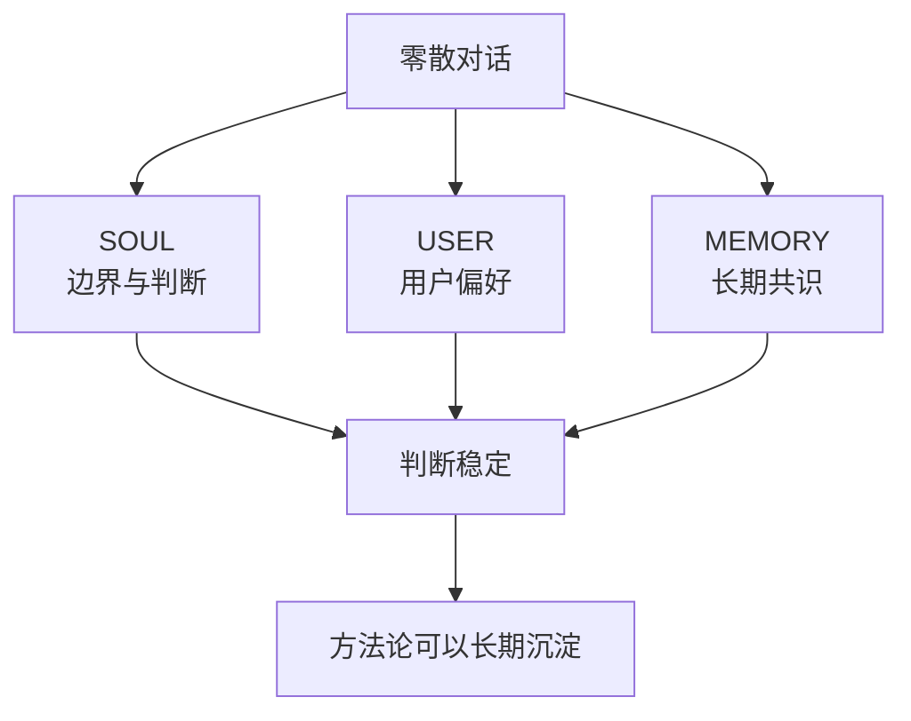
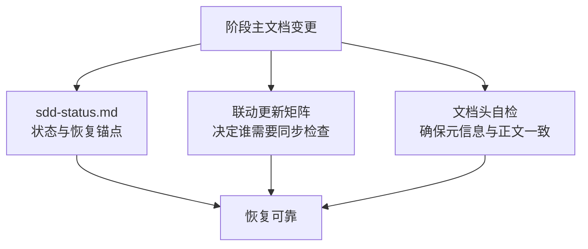
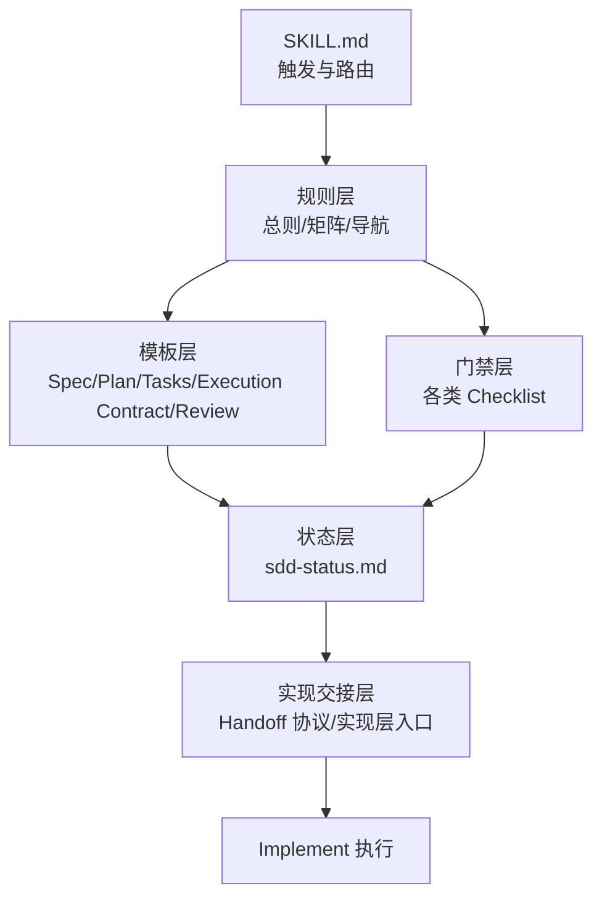
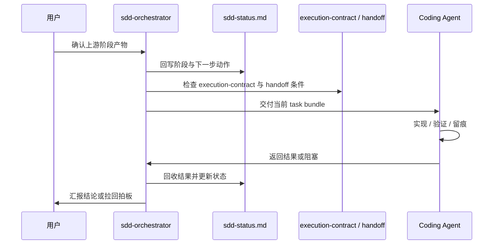

# 我把 AI 协作做成了一个可落地的 SDD 编排器：`sdd-orchestrator` 技术复盘

有一次，我们已经在对话里把一轮需求讨论、方案判断和后续任务都聊得很顺了。

表面上看，项目像是已经自然进入了下一阶段。  
但真回到仓库里一看，问题立刻暴露出来：

- `sdd-status.md` 的阶段理解已经往前走了
- 当前阶段主文档还没有完整落盘
- 下游文档已经先写起来了
- 对话里的“差不多”正在冒充项目里的“已确认”

这不是写作问题，也不是模型智商问题。  
这是一个更底层的问题：**协作失控了。**

也正是从这种真实失控开始，我和 AI 助手莫邪没有继续堆 prompt，也没有停在补几份模板上，而是把整套方法收成了一个 OpenClaw Skill：`sdd-orchestrator`。

它不是文档模板包，而是一个 **Spec-Driven Development（SDD）编排器**。它负责的不是“文档长什么样”，而是：

- 当前在哪个阶段
- 能不能进入下一阶段
- 当前状态靠什么恢复
- 文档变化后哪些地方要联动更新
- Implement 怎么交给 Coding Agent 才不失控
- Review 收口后，怎么保证语义和仓库快照一致

换句话说，它解决的是这个问题：

> **怎么把 AI 协作从“这轮聊得挺顺”，推进到“项目能稳定、可恢复、可交接地往前走”。**

这篇文章，我就把这件事怎么从 0 长出来、在哪些地方撞过墙、后来为什么会变成现在这套结构，完整复盘一遍。

---

## 一、真正的问题，不是 AI 不够聪明，而是协作没有操作系统

早期用 AI 推项目时，最容易产生的一种错觉是：

> 只要这轮对话聊顺了，项目就在推进。

但真实项目不是这么运转的。

“聊顺”和“推进”之间，至少隔着四层系统性约束：

1. **阶段边界**：当前到底在需求、方案、任务，还是已经进入实现？
2. **状态锚点**：下一次恢复时，应该从哪里接上？
3. **执行证据**：有没有真实文件改动、验证结果、提交记录？
4. **交接纪律**：任务交给子 agent 后，谁来保证边界不漂？

只要这四层不在，AI 协作再流畅，本质上也只是“高质量聊天”。

这就是我后来越来越明确的判断：

> 真正缺的，不是一个更会说的助手，而是一套协作操作系统。

而 `sdd-orchestrator`，就是这套操作系统在项目推进层的一次具体落地。

---

## 二、为什么 `sdd-orchestrator` 前面，必须先有 `SOUL / USER / MEMORY`

如果只看仓库，你会觉得 `sdd-orchestrator` 是一个独立冒出来的 skill。  
其实不是。

它前面有一层更基础的协作底座：

- `SOUL.md`
- `USER.md`
- `MEMORY.md`

很多人看到这些文件，会把它们理解成“给 AI 配人设”。

我现在更愿意把它们理解成：**协作基础设施**。

### 1. `SOUL.md` 解决判断一致性
不同会话里，助手不能像换了一个人。

它需要稳定知道：

- 什么情况下该主动收口
- 什么情况下该先理解、再行动
- 什么情况下不能替用户拍板
- 什么时候优先给结构，什么时候优先给下一步

### 2. `USER.md` 解决偏好稳定化
长期合作里，用户不应该每一轮都重新解释自己。

比如：

- 更偏好高层协作，不喜欢低层碎汇报
- 更在意阶段推进，而不是表面热闹
- 不接受“看起来推进了、实际上没有证据”的假推进

### 3. `MEMORY.md` 解决长期决策留存
很多关键约束，不应该只留在聊天记录里。

例如：

- 默认项目推进框架已经迁移为 SDD
- 没有清晰且确认的 Spec，不默认进入 Implement
- 阶段切换必须有真实执行证据支撑
- 轻场景少打断，重场景前确认

这些一旦不沉淀，下一轮协作就很容易掉回旧路径。

### 协作底座关系图



也就是说，`sdd-orchestrator` 不是凭空设计出来的。  
它是建立在一层已经逐渐稳定下来的长期协作底座之上的。

---

## 三、从 Scene/Mode 到 SDD：我们替换的不是聊天方式，而是项目推进模型

在 `sdd-orchestrator` 之前，我们其实已经有一套 Scene / Mode 机制。

它非常适合管理对话姿态：

- 闲聊时，不要突然上结构
- 发散时，不要过早收敛
- 规划时，要强调边界和取舍
- 推进时，要强调下一步和落地动作
- 复盘时，要看问题，不搞情绪归因

这套机制对对话层很有用，但它不够适合正式项目推进。

因为正式项目真正要回答的问题是：

- 当前属于哪一个正式阶段
- 当前阶段主文档是什么
- 进入下一阶段的门槛是什么
- 当前阶段有没有形成有效产物
- 当前中断点和下一步动作能否可靠恢复

于是后来我们做了一个关键迁移：

> Scene 保留，作为对话姿态层；SDD 上位，作为正式项目推进框架。

最终收口出来的默认阶段顺序是：

1. `Specify`
2. `Plan`
3. `Task`
4. `Implement`
5. `Review / Acceptance`

默认分工也同步明确下来：

- 用户更重点参与 `Specify / Plan / Task / 验收`
- 助手默认更多兜住 `Implement`

### 迁移前后的区别


这一步看起来只是方法名称变化，实际上影响非常大。  
因为从这里开始，“推进”不再以“聊了多少”为准，而开始以：

- 阶段文档
- 阶段门禁
- 阶段证据
- 阶段切换

这四件事为准。

---

## 四、为什么模板包不够，最终一定会长出“编排器”

很多 SDD 实践做到这里就停了：

- 有 `spec.md`
- 有 `plan.md`
- 有 `tasks.md`
- 有时再补一个 `review.md`

但真正跑一轮项目之后，很快就会发现：模板解决的是“写什么”，并不自动解决“怎么推进”。

真实项目里最容易出问题的，恰恰是下面这些地方：

### 1. 文档存在，不等于阶段成立
例如：

- `spec.md` 只是对话里形成的骨架
- 用户并没有明确确认
- 但后面已经顺手开始写 `plan.md`

这就是典型的阶段漂移。

### 2. 草案、定稿、状态卡可能互相打架
如果没有统一约束，项目里很容易同时出现：

- 内容像定稿
- 文件名像草稿
- 状态卡却写着已确认

一旦出现这种不一致，中断恢复就会变得非常痛苦。

### 3. 多轮 SDD 后，当前轮次很容易失焦
第一轮可能是：

- `spec.md`
- `plan.md`
- `tasks.md`

但到第二轮、第三轮，往往已经变成：

- `spec-002`
- `plan-002`
- `task-002`
- `execution-contract-002`

与此同时，`review.md` 和 `sdd-status.md` 又可能继续作为固定入口文档。

如果没有映射规则，多轮 SDD 后的恢复几乎一定会乱。

### 4. Implement 阶段最容易重新变成黑箱
一旦任务开始交给 Coding Agent，问题会立刻升级：

- 当前交的是整份 `tasks.md`，还是一个 task bundle？
- 允许不允许局部重构？
- 允许不允许顺手扩范围？
- 验证结果写到哪里？
- 什么时候必须停止并回主对话？

模板包通常不回答这些问题。

所以后来我们越来越明确：

> `sdd-orchestrator` 不能只是模板集合，它必须是一个 **协作编排器**。

也就是：它不只管文档格式，而是开始管阶段、状态、恢复、联动和交接。

---

## 五、一次真实修正：我们怎么把状态卡从“看起来已推进”拉回到“真实可恢复”

如果要选一个最能说明 `sdd-orchestrator` 为什么会长出来的例子，我会选 `local-kb-assistant` 的那次阶段推进修正。

当时的问题不是“方向错了”，而是**状态不自洽**。

表面上看，项目像是已经从上一阶段继续往下走了。  
但真落回项目文件时，我们发现几件事没有对齐：

- `sdd-status.md` 的阶段理解已经往前切了
- 当前阶段主文档和下一阶段主文档没有形成完整闭环
- 对话里的阶段理解，正在提前替代项目里的真实状态

这时候如果继续往前推，后面会越来越乱。  
于是我们没有硬着头皮“将错就错”，而是先做了一次非常关键的动作：

> **把状态卡收回到真实切换点。**

然后才重新按顺序做事：

1. 先把阶段主文档落盘
2. 再做当前阶段的门禁收口
3. 再确认是否允许进入下一阶段
4. 再继续落 `plan-002 / task-002 / execution-contract-002`
5. 最后才重新进入 Implement

这次修正给了我一个很硬的判断：

> 真正可靠的推进，不是顺着对话感觉往前走，而是顺着项目里真实已落盘的状态往前走。

很多后来被写进 `sdd-orchestrator` 的规则，其实都直接来自这类修正，而不是抽象推演。

---

## 六、为什么后来一定会长出 `sdd-status`、联动矩阵和文档头自检

随着实战推进，我们后来发现，真正让协作系统变稳的，不是继续加模板，而是补三类机制。

### 1. `sdd-status.md`：恢复锚点
它承担的角色不是“补充说明”，而是：

- 当前阶段锚点
- 当前中断点锚点
- 当前有效轮次文档映射
- 下一步唯一推荐动作

没有这张状态卡，多轮 SDD 很快就会失去连续性。

### 2. `SDD 联动更新矩阵.md`：联动纪律
只要 Spec、Plan、Tasks、Execution Contract 中任意一个发生变化，下游文档就很可能需要重新检查。

如果没有明确矩阵，项目很容易出现这种情况：

- `spec.md` 已经变了
- `tasks.md` 还在沿用旧边界
- `review.md` 评审的也是旧范围

联动矩阵本质上是在解决一件事：**文档系统的数据一致性。**

### 3. `document-header-checklist.md`：文档头自检
这条规则看起来很“土”，但特别有效。

因为很多时候，正文已经切到当前轮次了，但文档头还停留在上一轮：

- 文档名称没改
- 所属功能字段没改
- 上游文档路径没改
- 更新时间没改

这类问题如果不专门管，长期一定会积累成恢复灾难。

### 三个关键机制的关系



---

## 七、最小运行闭环：`sdd-orchestrator` 实际上是怎么工作的

如果要把这套体系压缩成一个最小闭环，其实可以概括成下面这条链：

1. 用户提出需求
2. `sdd-orchestrator` 识别当前所处阶段
3. 起草或收口当前阶段主文档
4. 用对应 checklist 做阶段门禁判断
5. 回写 `sdd-status.md`
6. 到达 Implement 前，形成 `execution-contract.md`
7. 按 task bundle handoff 给 Coding Agent
8. 回收结果，更新状态卡和 review 结论

### 最小闭环图


这条链看起来简单，但它解决了一个以前很难稳定处理的问题：

> 聊天、文档、实现、回收，不再是四段松散动作，而被串成了一条可恢复的推进链路。

---

## 八、到后面，仓库结构才真正开始像一个“系统”，而不是“资料夹”

随着规则逐渐稳定，`sdd-orchestrator` 仓库也被收成了现在这套结构：

```text
sdd-orchestrator/
├── README.md
├── SKILL.md
└── references/
    ├── 索引与导航.md
    ├── SDD 模板总则.md
    ├── SDD 联动更新矩阵.md
    ├── Coding Agent Handoff 协议.md
    ├── 实现层入口与链路.md
    ├── core-templates/
    │   ├── spec.md
    │   ├── plan.md
    │   ├── tasks.md
    │   ├── execution-contract.md
    │   ├── sdd-status.md
    │   └── review.md
    └── checklists/
        ├── specify-checklist.md
        ├── plan-checklist.md
        ├── tasks-checklist.md
        ├── implement-handoff-checklist.md
        ├── review-checklist.md
        └── document-header-checklist.md
```

这里最重要的，不是文件更多了，而是分层终于清楚了：

### `SKILL.md`：入口层
负责：

- 触发条件
- 核心硬规则
- 场景分流
- 最小读取路径

### `references/`：规则层
负责：

- 上位原则
- 联动规则
- 目录导航
- 实现层链路说明

### `core-templates/`：模板层
负责：

- 阶段主文档模板
- 状态卡模板
- review 模板

### `checklists/`：门禁层
负责：

- 是否能进入下一阶段
- 是否满足 handoff 条件
- 是否完成 review 收口
- 是否存在文档头不一致

### 分层结构图



这时候，`sdd-orchestrator` 才开始真正具备“系统感”。

---

## 九、为什么一定要把 Implement 单独拉出一层：`execution-contract` + handoff 协议

如果一个系统只管到 `tasks.md`，那它其实还没解决最危险的部分。

最危险的部分恰恰发生在 Implement：

- 任务怎么拆交给 Coding Agent
- 什么范围可以改，什么范围不许碰
- 当前权威输入到底是哪组文档
- 出现阻塞时该不该停
- 结果返回后由谁回收、谁更新状态

所以后来我们明确把 Implement 前后单独抽出了一层：

- `execution-contract.md`
- `implement-handoff-checklist.md`
- `Coding Agent Handoff 协议.md`
- `Coding Agent 上下文隔离协议.md`
- `实现层入口与链路.md`

核心思想其实就一句：

> **编排层、交接层、施工层，必须分开。**

也就是：

- `sdd-orchestrator` 负责“怎么推进”
- handoff 协议负责“怎么稳地交出去”
- Coding Agent 负责“怎么施工”

### Implement 交接序列图



从这里开始，Implement 不再是黑箱，而变成了可控链路。

---

## 十、它解决什么，不解决什么

我觉得这部分很重要，因为它决定了 `sdd-orchestrator` 的边界是不是清楚。

### 它解决什么
它解决的是：

- SDD 阶段编排
- 阶段门禁判断
- 文档联动更新
- `sdd-status.md` 驱动的恢复
- Implement 前 handoff 准备
- Coding Agent 回收后的状态闭环
- Review / Acceptance 的结构化收口

### 它不解决什么
它不负责：

- 直接替代 Coding Agent 写具体实现
- 语言 / 框架级编码规范本身
- 大量代码细节级 review 规则
- 项目管理软件层面的排期、资源管理、燃尽图之类的能力

它的定位始终是：

> **项目推进层的 SDD 编排器，而不是实现专家，也不是通用 PM 平台。**

这层边界越清楚，它越能稳定演化。

---

## 十一、提交历史其实很能说明：这不是“先设计完整再实现”，而是“实战—补规则—再实战”

如果你看这几天的提交，会发现一个很明显的现象：

`sdd-orchestrator` 的演化重点，不是继续“加模板”，而是不断补系统性约束。

| 日期 | Commit | 含义 |
|---|---|---|
| 2026-03-22 | `b141e8e` | 初始化 skill 包与试运行文档 |
| 2026-03-22 | `e2fef6a` | 补充阶段确认后主文档状态回写规则 |
| 2026-03-22 | `aa40630` | 补充状态回写与检查单约束 |
| 2026-03-23 | `749be9e` | 补充阶段主文档落盘门槛 |
| 2026-03-23 | `0105d40` | 补充阶段确认后的命名收口约束 |
| 2026-03-23 | `fd62afb` | 补充通用阶段切换动作清单 |
| 2026-03-23 | `217a643` | 补充阶段起步与状态卡锚定约束 |
| 2026-03-24 | `4d24fc1` | 强化场景动作协议与文档自检机制 |
| 2026-03-24 | `cca6021` | 补强 review 收口联动与检查逻辑 |
| 2026-03-24 | `e0b353a` | 收束模板总则与文档头自检入口 |
| 2026-03-24 | `7123419` | 清理 references 版本状态残留措辞 |

这份提交历史说明了一个很重要的事实：

> 一套协作系统真正成熟时，重点不会停留在“内容更丰富”，而会转向“边界更清楚、恢复更可靠、状态更一致、交接更可控”。

这也是我现在判断一个方法论是否真的开始工程化的标准。

---

## 十二、从今天往后看，`sdd-orchestrator` 的下一层价值，不止是项目推进，而是组织协作底座

如果 `sdd-orchestrator` 只停留在“单项目方法论工具”，它的价值其实只完成了一半。

因为走到现在，它已经开始具备另一种能力：

**为多 agent、多席位的协作提供统一秩序。**

这也是为什么它会自然延伸到 `OpenClaw-软件部门`。

当你开始认真想“软件部门”这件事时，真正的问题不是多建几个 agent，而是：

- 谁负责需求和方案
- 谁负责实现
- 谁负责 QA / 文档 / review
- 不同席位如何避免上下文污染
- 统一的阶段推进、状态卡、交接协议、Review 收口由谁约束

而这些问题，恰好和 `sdd-orchestrator` 现在已经在解决的问题高度同构。

### 演化路径图


也就是说，它现在已经不只是一个“项目 skill”了。  
它更像是：

> **软件部门内部协作操作系统的第一块稳定基石。**

---

## 十三、这次最值得带走的 7 个工程结论

### 1. 长期协作必须先有底座，再谈项目方法论
没有 `SOUL / USER / MEMORY`，后面的项目方法论很难稳定下来。

### 2. Scene/Mode 适合对话姿态，SDD 才适合正式项目推进
这两层不是互斥关系，而是职责不同。

### 3. 模板不等于系统
真正让系统稳定的，是阶段门禁、状态卡、联动矩阵、交接协议。

### 4. 没有执行痕迹，不算推进
这条规则直接清掉了大量假推进和自我感动式推进。

### 5. 当前阶段主文档未落盘，不得口头进入下游阶段
这条规则显著降低了后期返工和恢复混乱。

### 6. Review 收口后仍要检查仓库快照是否稳定
不然“语义通过”和“工程稳定”会被错误混为一谈。

### 7. 组织化协作一定建立在项目级秩序之上
单项目推进都还不稳定，就谈不上多 agent 的软件部门。

---

## 十四、结尾：`sdd-orchestrator` 最重要的价值，不是文档多漂亮，而是它让 AI 协作第一次真正“像工程系统”

回头看这一路，我现在最强烈的感受反而很朴素：

我们真正做成的，不是一套 Markdown 模板，也不只是一个 OpenClaw Skill。

我们做成的，是一套开始具备工程属性的 AI 协作系统：

- 有边界
- 有阶段
- 有状态
- 有恢复
- 有交接
- 有留痕
- 有收口

从最开始没有章法；
到补 `SOUL / USER / MEMORY`；
再到把 Scene/Mode 迁到 SDD；
再到在真实项目里长出 `sdd-status`、联动矩阵、文档头自检、`execution-contract` 和 handoff 协议；
再到今天开始往 `OpenClaw-软件部门` 演化。

这条线对我最大的意义是：

> **AI 协作真正成熟，不是因为它越来越像人，而是因为它终于开始像一个能持续运行的工程系统。**

而 `sdd-orchestrator`，就是这套系统目前最完整的一次落盘。

---

## 附：如果你也想做类似系统，建议按这个顺序开始

1. 先把长期协作里的边界、偏好、长期记忆显式化
2. 再把项目推进从“聊天式推进”切到“阶段式推进”
3. 给每个阶段补主文档、门禁和状态锚点
4. 给 Implement 单独补交接层
5. 在真实项目里跑一轮，再把撞出来的问题写回规则层

不要一上来就追求“完美方法论”。

更可行的路径其实一直都是：

> **先跑起来，再把真实问题收成下一版系统。**